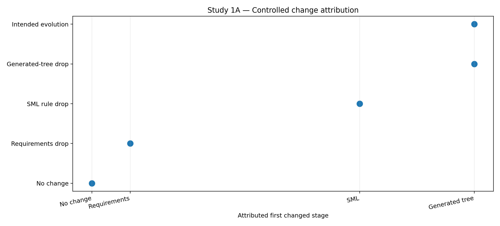
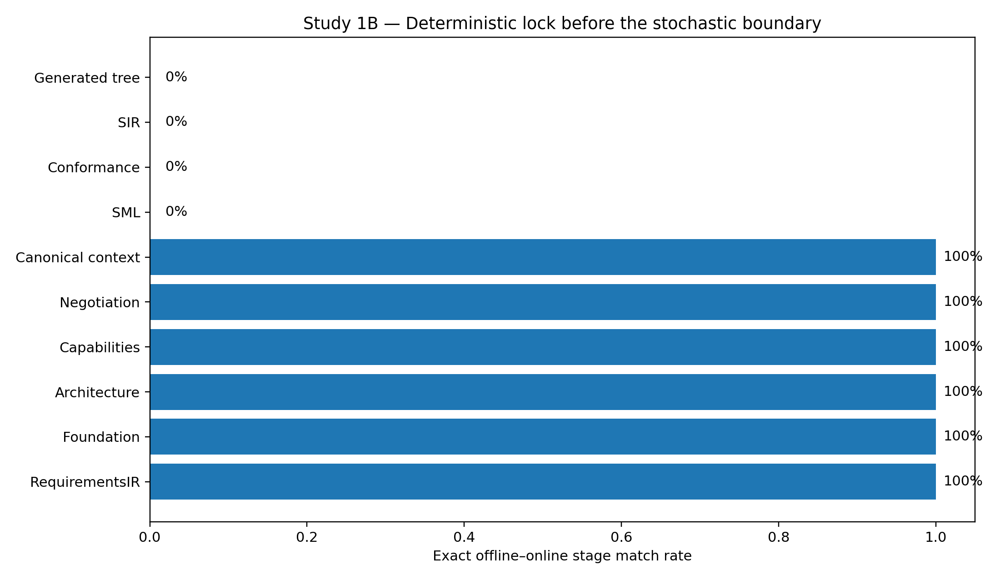
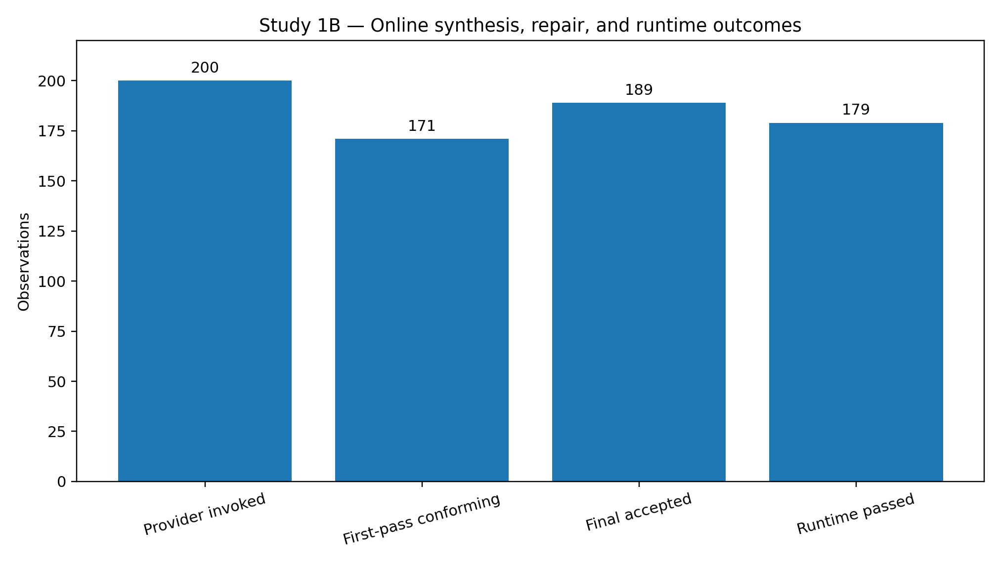
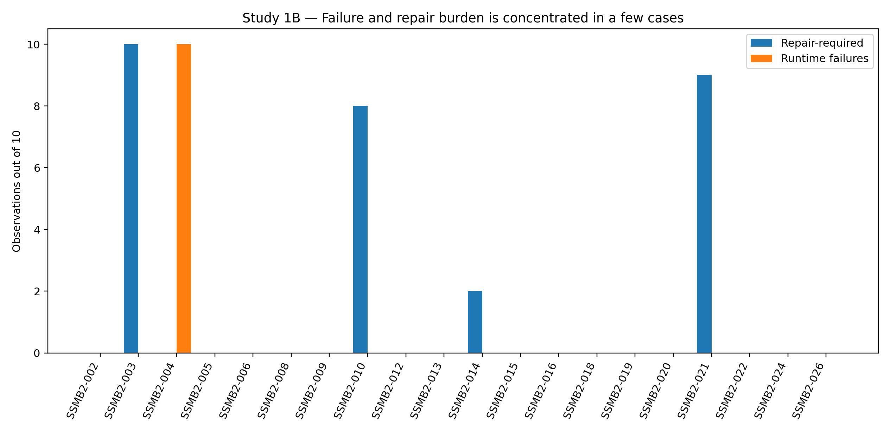

# Study 1 — Final Figures and Tables

These figures and tables are derived from the frozen Study 1A and Study 1B evidence bundles. Percentages use the denominators stated in each caption.

**Figure 1. Study 1A controlled first-change attribution.** The no-change control has no changed stage; the three degradation controls are attributed to their injected stage; intended evolution is localized to the generated-tree stage.

**Figure 2. Study 1B exact offline–online stage match rates.** Deterministic semantic stages through CanonicalSemanticContext match exactly across all 300 pairs. Exact identity diverges at the probabilistic SML boundary and remains non-identical downstream.

**Figure 3. Study 1B online synthesis outcomes.** Of 200 provider-invoked observations, 171 passed on the first candidate, 189 passed after bounded repair, and 179 accepted applications passed independent runtime contracts.

**Figure 4. Study 1B case-level concentration of repair burden and runtime failure.** Repair demand is concentrated in SSMB2-003, SSMB2-010, SSMB2-014 and SSMB2-021; runtime failures are concentrated in SSMB2-004.

## Table 1. Study 1A controlled evolution conditions

Primary metric and attribution for the frozen control/intervention campaign.

| condition           | verdict            | first_changed_stage   | primary_metric            |   baseline_mean |   candidate_mean |    effect |     p_value |
|:--------------------|:-------------------|:----------------------|:--------------------------|----------------:|-----------------:|----------:|------------:|
| no_change           | NO_MATERIAL_CHANGE | none                  | compile_success           |        0.633333 |         0.633333 |  0        | 1           |
| requirements_drop   | REGRESSION         | requirements          | oracle_requirement_recall |        1        |         0.766667 | -0.233333 | 1.02951e-84 |
| sml_rule_drop       | REGRESSION         | sml                   | compile_success           |        0.633333 |         0.3      | -0.333333 | 1.57772e-30 |
| generated_tree_drop | REGRESSION         | generated_tree        | compile_success           |        0.633333 |         0        | -0.633333 | 1.27447e-57 |
| intended_evolution  | INTENDED_EVOLUTION | generated_tree        | generated_file_count      |       55.0333   |        55.6667   |  0.633333 | 1.27447e-57 |

## Table 2. Study 1B aggregate results

The online repeated arm used 30 cases × 10 replicates; 100 observations were deterministically blocked before provider invocation.

| measure                                 |      value | interpretation                                   |
|:----------------------------------------|-----------:|:-------------------------------------------------|
| Total online observations               | 300        | 30 cases × 10 replicates                         |
| Provider-invoked observations           | 200        | Stochastic boundary reached                      |
| First-candidate conformance             |   0.855    | 171/200 provider-invoked                         |
| Final conformance / acceptance          |   0.945    | 189/200 provider-invoked                         |
| Runtime-contract pass                   |   0.94709  | 179/189 accepted applications                    |
| Normalized offline↔online outcome match |   0.996667 | ACCEPTED and CONDITIONAL normalized to GENERATED |
| Upstream stage lock                     |   1        | Requirements through canonical semantic context  |
| Cases with SML surface variance         |  20        | 20/20 provider-invoked cases                     |
| Cases with SIR variance                 |  19        | 19 accepted-generating cases                     |
| Cases with generated-tree variance      |  19        | 19 accepted-generating cases                     |

## Table 3. Study 1B case-level online outcomes

Case-level concentration of provider invocation, repair, acceptance and runtime failure.

| case_id   |   provider_invoked |   first_pass |   repair_required |   final_accepted |   runtime_executed |   runtime_failed |
|:----------|-------------------:|-------------:|------------------:|-----------------:|-------------------:|-----------------:|
| SSMB2-001 |                  0 |            0 |                 0 |                0 |                  0 |                0 |
| SSMB2-002 |                 10 |           10 |                 0 |               10 |                 10 |                0 |
| SSMB2-003 |                 10 |            0 |                10 |                0 |                  0 |                0 |
| SSMB2-004 |                 10 |           10 |                 0 |               10 |                 10 |               10 |
| SSMB2-005 |                 10 |           10 |                 0 |               10 |                 10 |                0 |
| SSMB2-006 |                 10 |           10 |                 0 |               10 |                 10 |                0 |
| SSMB2-007 |                  0 |            0 |                 0 |                0 |                  0 |                0 |
| SSMB2-008 |                 10 |           10 |                 0 |               10 |                 10 |                0 |
| SSMB2-009 |                 10 |           10 |                 0 |               10 |                 10 |                0 |
| SSMB2-010 |                 10 |            2 |                 8 |               10 |                 10 |                0 |
| SSMB2-011 |                  0 |            0 |                 0 |                0 |                  0 |                0 |
| SSMB2-012 |                 10 |           10 |                 0 |               10 |                 10 |                0 |
| SSMB2-013 |                 10 |           10 |                 0 |               10 |                 10 |                0 |
| SSMB2-014 |                 10 |            8 |                 2 |               10 |                 10 |                0 |
| SSMB2-015 |                 10 |           10 |                 0 |               10 |                 10 |                0 |
| SSMB2-016 |                 10 |           10 |                 0 |               10 |                 10 |                0 |
| SSMB2-017 |                  0 |            0 |                 0 |                0 |                  0 |                0 |
| SSMB2-018 |                 10 |           10 |                 0 |               10 |                 10 |                0 |
| SSMB2-019 |                 10 |           10 |                 0 |               10 |                 10 |                0 |
| SSMB2-020 |                 10 |           10 |                 0 |               10 |                 10 |                0 |
| SSMB2-021 |                 10 |            1 |                 9 |                9 |                  9 |                0 |
| SSMB2-022 |                 10 |           10 |                 0 |               10 |                 10 |                0 |
| SSMB2-023 |                  0 |            0 |                 0 |                0 |                  0 |                0 |
| SSMB2-024 |                 10 |           10 |                 0 |               10 |                 10 |                0 |
| SSMB2-025 |                  0 |            0 |                 0 |                0 |                  0 |                0 |
| SSMB2-026 |                 10 |           10 |                 0 |               10 |                 10 |                0 |
| SSMB2-027 |                  0 |            0 |                 0 |                0 |                  0 |                0 |
| SSMB2-028 |                  0 |            0 |                 0 |                0 |                  0 |                0 |
| SSMB2-029 |                  0 |            0 |                 0 |                0 |                  0 |                0 |
| SSMB2-030 |                  0 |            0 |                 0 |                0 |                  0 |                0 |

## Table 4. Offline versus online semantic fidelity

Independent semantic-oracle means are identical across the offline and online arms.

| metric                    |   offline_mean |   online_mean |   effect |
|:--------------------------|---------------:|--------------:|---------:|
| oracle_requirement_recall |       1        |      1        |        0 |
| oracle_foundation_recall  |       0.887222 |      0.887222 |        0 |
| oracle_capability_recall  |       1        |      1        |        0 |
| oracle_semantic_score     |       0.981204 |      0.981204 |        0 |

